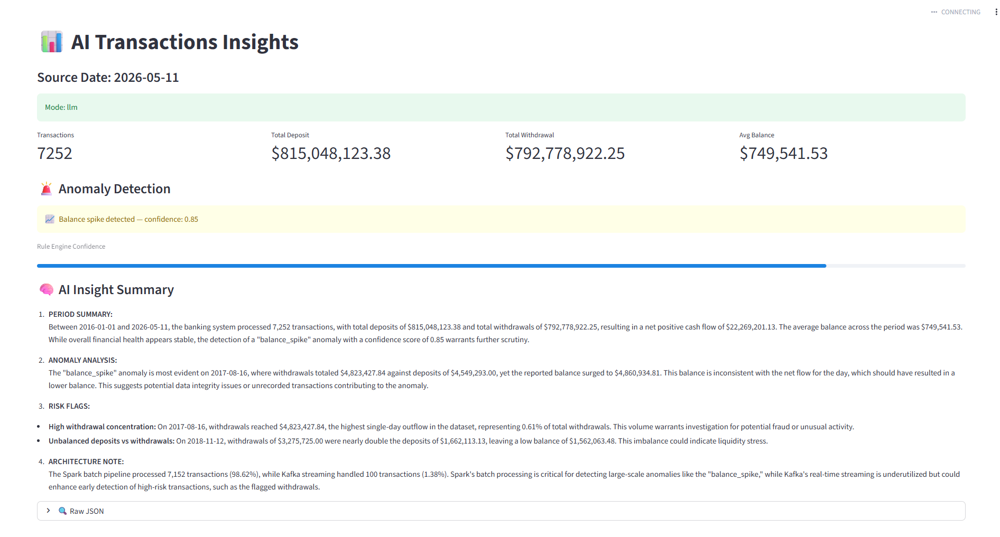
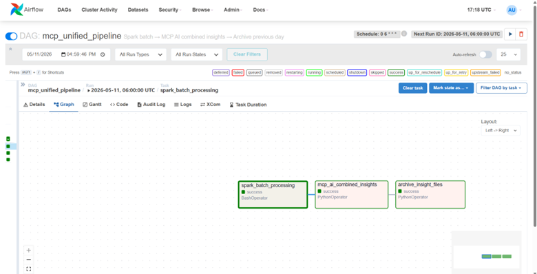

## 🏦 AI Unified Data Platform

## Real-Time & Batch Transaction Intelligence


A fully operational data engineering pipeline that processes synthetic banking transactions through dual ingestion paths — Apache Spark batch + Apache Kafka streaming — stores clean data in PostgreSQL, and generates AI-powered financial anomaly summaries via GPT-4o. Orchestrated end-to-end on Apache Airflow.

---
🏗️ Architecture
```
╔══════════════════════════════════════════════════════════════╗
║                       DATA SOURCES                           ║
║      CSV / Parquet Files            Kafka Topic              ║
║          (historical)                (real-time)             ║
╚══════════╦═══════════════════════════════════╦═══════════════╝
           ║                                   ║
┌──────────▼──────────┐           ┌────────────▼────────────┐
│  Spark Batch ETL    │           │ Spark Structured        │
│                     │           │ Streaming               │
│ • Multi-format read │           │ • foreachBatch()        │
│ • Column normalize  │           │ • 10s micro-batches     │
│ • Type casting      │           │ • Checkpoint recovery   │
│ • Bad record split  │           │ • Idle auto-stop        │
└──────────┬──────────┘           └────────────┬────────────┘
           ║                                   ║
╔══════════▼═══════════════════════════════════▼═════════════╗
║               Shared Transformation Layer                  ║
║  clean_and_cast → add_error_column → finalize_good_data    ║
╚══════════╦═══════════════════════════════════╦═════════════╝
           ║                                   ║
┌──────────▼──────────┐           ┌────────────▼────────────┐
│    PostgreSQL       │           │  Bad Records Store      │
│ • Schema evolution  │           │  timestamped CSV        │
│ • JDBC append       │           │  error_reason column    │
└──────────┬──────────┘           └─────────────────────────┘
           ║
╔══════════▼═════════════════════════════════════════════════╗
║                 Insight Generation Layer                   ║
║  generate_insights_from_df()                               ║
║    → insight_spark_batch_{date}.json                       ║
║    → insight_kafka_stream_{date}.json                      ║
╚══════════╦═════════════════════════════════════════════════╝
           ║
╔══════════▼═════════════════════════════════════════════════╗
║                   AI Insight Engine                        ║
║                                                            ║
║  rule_engine.py    →  deterministic ground truth           ║
║        ↓                                                   ║
║  insight_engine.py →  aggregated prompt (~800 tokens)      ║
║        ↓                                                   ║
║  github_client.py  →  GPT-4o via GitHub Models             ║
║        ↓                                                   ║
║  cache_store.py    →  MD5-keyed, no duplicate LLM calls    ║
║        ↓                                                   ║
║  ai_insights_combined_{date}.json                          ║
╚══════════╦═════════════════════════════════════════════════╝
           ║
╔══════════▼═════════════════════════════════════════════════╗
║              Apache Airflow Orchestration                  ║
║                                                            ║
║  spark_batch_processing                                    ║
║       └──→ ai_combined_insights                            ║
║                 └──→ archive_insight_files                 ║
║                                                            ║
║  Schedule: Daily 06:00 UTC                                 ║
║  Retries: 2 × 5 min delay   |   SLA: 1 hr                  ║
╚════════════════════════════════════════════════════════════╝
```
---
🔬 Key Engineering Decisions
1. Token-Efficient LLM Prompt Design

A naive implementation serializes all rows directly into the prompt string. At 225 grouped rows this produced a 34,286-character prompt (~8,500 tokens), hitting GPT-4o's GitHub Models limit and causing pipeline failure.
Fix: Send only aggregated signals — rule engine output + top-5 withdrawal days + top-5 deposit days. Prompt size is now constant regardless of transaction volume.

| Volume | Naive Approach | This Pipeline |
|--------|---------------|--------------|
| 728 txns → 225 grouped rows | ~8,500 tokens ❌ | ~800 tokens ✅ |
| 50,000 transactions | ~750,000 tokens ❌ | ~800 tokens ✅ |
| 5,000,000 transactions | Impossible ❌ | ~800 tokens ✅ |

---
2. Rule Engine as Immutable Ground Truth

`rule_engine.py` always runs before any LLM call and produces deterministic aggregates. The LLM receives these numbers as fixed facts and is instructed only to narrate — never to recalculate. This prevents hallucinated figures in financial output.
```
raw_transactions
      ↓
rule_engine.py  →  { total_txns, deposits, withdrawals, anomaly, confidence }
      ↓
LLM receives these as GROUND TRUTH — narrates, never recalculates
```
---
3. Graceful Fallback — Never Silent Failure

If the LLM call fails for any reason, the pipeline falls back to a structured natural-language summary built entirely from rule engine output. The specific error is surfaced in the JSON. No crashes, no empty responses.
```json
{
  "source_date": "2026-05-10",
  "ai_summary": "LLM unavailable. Using deterministic rule-based insights.",
  "rule_summary": {
    "total_transactions": 67,
    "total_deposit": 7000000.0,
    "total_withdrawal": 6445957.0,
    "avg_balance": 4188171.79,
    "anomaly": "normal",
    "confidence": 0.9
  },
  "mode": "fallback",
  "error": "GitHub Model Error: Unauthorized\n",
  "note": "Combined insight generated from Spark only. Only Spark pipeline ran today (/opt/project/insights/insight_spark_batch_2026-05-10.json). No Kafka file was available."
}
```
---
4. Incremental Kafka Insight Merging

Kafka micro-batches arrive every 10 seconds. A naive approach overwrites the daily insight file on each batch. Instead, batches are merged using a weighted-average balance calculation so daily totals accumulate correctly.
```python
ex["avg_balance"] = (
    (ex["avg_balance"] * n_old + r["avg_balance"] * n_new)
    / (n_old + n_new)
)
```
---
5. MD5-Keyed Insight Cache

LLM calls are rate-limited and costly. Each result is cached using an MD5 key derived from `source_date` + transaction fingerprint. Re-running the pipeline on the same data skips the LLM entirely.

---

📁 Project Structure
```
ai-unified-data-platform/
│
├── spark_dynamic_pipeline.py       # Spark batch ETL — ingest, clean, write, insights
├── kafka_streaming_pipeline.py     # Kafka streaming — micro-batch processing
├── schema.py                       # Shared Spark schema definition
├── db_utils.py                     # JDBC config, schema evolution helpers
├── insight_store.py                # DataFrame → aggregated insight JSON
│
├── ai_insight_engine/
│   ├── app.py                      # Entry point — merges spark + kafka insight files
│   ├── insight_engine.py           # Orchestrates rule engine + LLM call + cache
│   ├── rule_engine.py              # Deterministic aggregation and anomaly detection
│   ├── github_client.py            # GitHub Models API client (GPT-4o)
│   └── cache_store.py              # MD5-keyed result cache
│
├── dags/
│   └── batch_ai_pipeline_dag.py    # Airflow DAG — scheduling, retries, archival
│
├── data/
│   ├── input_file/                 # Drop CSV / Parquet files here
│   └── bad_records/                # Rejected rows — timestamped CSV per run
│
├── insights/
│   ├── insight_spark_batch_{date}.json
│   ├── insight_kafka_stream_{date}.json
│   ├── ai_insights_combined_{date}.json
│   └── archive/                    # Previous day's files auto-moved by Airflow
│
├── checkpoint/                     # Spark-managed Kafka stream checkpoint
├── .env.example
├── docker-compose.yml
└── requirements.txt
```
---

🚨 Data Quality — Bad Record Handling
Every row passes four validation gates before reaching PostgreSQL. Bad records are written to a timestamped CSV with the `error_reason` column populated. Neither path blocks the other.
| Validation Rule | Error Label |
|----------------|------------|
| `transaction_date` cannot be parsed as `dd-MMM-yy` | `Invalid Date` |
| `account_no` is blank or whitespace | `Missing Account` |
| `withdrawal_amt` is non-empty but non-numeric | `Invalid Withdrawal Amt` |
| `deposit_amt` is non-empty but non-numeric | `Invalid Deposit Amt` |

---

## Screenshots




---

👩‍💻 Author

Priyusha - Data Engineer · Master of Science (MS) Student in Information Studies


5+ years of experience designing and building data pipelines across batch and streaming systems. This project reflects full-stack data engineering ownership — from raw ingestion to AI-augmented analytics — without relying on managed services.

Skills demonstrated:


---
